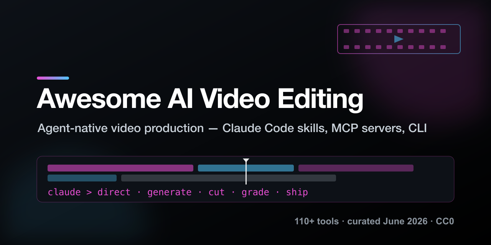

# Awesome AI Video Editing [](https://awesome.re)

<p align="center">
  
</p>

> A curated list of **AI-powered video editing & production tools** for developers and creators, with a unique focus on the 2026 wave of **agent-native tooling**: Claude Code skills, MCP servers, and CLI-first pipelines that let a coding agent direct the whole production.

⭐ Star counts harvested live on **2026-06-12** (GitHub API). PRs welcome.

**The 2026 meta-shift:** new video tools no longer ship as apps, they ship as **agent skills and MCP servers**. The fastest-growing repos of the last 90 days (OpenMontage, ArcReel, html-video, Generative-Media-Skills, waoowaoo, Toonflow) are all agent-first. Premium differentiation moved from model quality to **orchestration + cross-shot consistency**.

## Contents

- [Agent-Native, Claude Code / MCP / CLI](#agent-native-claude-code--mcp--cli)
- [Agentic Video Production Platforms](#agentic-video-production-platforms)
- [Video Generation Models & Inference](#video-generation-models--inference)
- [ComfyUI Video Ecosystem](#comfyui-video-ecosystem)
- [Programmatic Video (Code IS the Video)](#programmatic-video-code-is-the-video)
- [Editors, AI-Augmented, Browser & Classic](#editors-ai-augmented-browser--classic)
- [DaVinci Resolve Stack](#davinci-resolve-stack)
- [Avatars, Talking Heads & Face Tools](#avatars-talking-heads--face-tools)
- [Audio, Voice & Music for Video](#audio-voice--music-for-video)
- [Enhance, Upscale & Finish](#enhance-upscale--finish)
- [Reference Pipeline: Claude Code as Director](#reference-pipeline-claude-code-as-director)
- [Contributing](#contributing)

## Agent-Native: Claude Code / MCP / CLI

The category that didn't exist a year ago: video production exposed as agent skills.

- [OpenMontage](https://github.com/calesthio/OpenMontage) ⭐44.3k, First open agentic video production system: 12 pipelines, 52 tools, 500+ agent skills. Your coding agent becomes the director. AGPL.
- [Generative-Media-Skills](https://github.com/SamurAIGPT/Generative-Media-Skills) ⭐3.9k, Multi-modal media skills (image/video/audio) for Claude Code, Cursor & Gemini CLI.
- [html-video](https://github.com/nexu-io/html-video) ⭐4.2k, Programmatic video for coding agents: HTML/CSS + data → real MP4s, locally.
- [FireRed-OpenStoryline](https://github.com/FireRedTeam/FireRed-OpenStoryline) ⭐3.2k, AI video editing agent, intention-driven directing via MCP + skills.
- [ArcReel](https://github.com/ArcReel/ArcReel) ⭐3.8k, Video workspace built on claude-agent-sdk: novel → characters → storyboard → video with cross-shot consistency.
- [MiniMax-MCP](https://github.com/MiniMax-AI/MiniMax-MCP) ⭐1.5k, Official MCP server: TTS, image and video generation APIs.
- [claude-code-video-toolkit](https://github.com/digitalsamba/claude-code-video-toolkit) ⭐1.9k, AI-native video production toolkit built specifically for Claude Code (ElevenLabs integration).
- [davinci-resolve-mcp](https://github.com/samuelgursky/davinci-resolve-mcp) ⭐1.9k, Drive DaVinci Resolve Studio from your agent: timeline, cuts, color.
- [short-video-maker](https://github.com/gyoridavid/short-video-maker) ⭐1.3k, TikTok / Reels / Shorts generation via MCP + REST API.
- [douyin-mcp-server](https://github.com/yzfly/douyin-mcp-server) ⭐1.2k · archived, Douyin video ingest (watermark-free links + transcripts) as Claude skill/MCP.
- [muapi-cli](https://github.com/SamurAIGPT/muapi-cli) ⭐1.0k, Terminal CLI + MCP server for 14 generative models (image/video/audio).
- [vargHQ/sdk](https://github.com/vargHQ/sdk) ⭐332, "JSX for videos": one TypeScript API for Kling, Flux, ElevenLabs, Veed. Built on Vercel AI SDK.
- [yt-dlp-mcp](https://github.com/kevinwatt/yt-dlp-mcp) ⭐264, Bridge video/audio content to LLMs via yt-dlp.
- [comfyui-mcp](https://github.com/artokun/comfyui-mcp) ⭐466, Claude Code plugin + MCP for ComfyUI: 88 tools, 14 skills (Flux, WAN, LTX-Video, Qwen), live graph editing.
- [ffmpeg-mcp](https://github.com/video-creator/ffmpeg-mcp) ⭐140, Local video editing through conversation: FFmpeg as an MCP server.
- [hve-spielberg](https://github.com/nebrass/hve-video-director) ⭐129, 6-phase video production pipeline for Claude Code, design thinking → final render.
- [mcptube](https://github.com/0xchamin/mcptube) ⭐145, Turn YouTube into a compounding knowledge base (transcripts + vision) for Claude/Codex/Gemini.
- [claude-skills (video)](https://github.com/jianshuo/claude-skills) ⭐111, 13 Claude Code skills: transcribe / translate / dub / multicam / subtitles / reframe.
- [ComfyUI-Expert](https://github.com/MCKRUZ/ComfyUI-Expert) ⭐85 · archived, Session-scoped Claude Code agent for ComfyUI video production (12 skills).
- [remotion-transitions](https://github.com/Ashad001/remotion-transitions) ⭐66, Production-ready Remotion transition patterns with Claude Code skills.
- [remotion-superpowers](https://github.com/DojoCodingLabs/remotion-superpowers) ⭐89, Claude Code plugin: a full video production studio for Remotion (AI voiceovers, music, stock, gen).
- [SwiftClip](https://github.com/zz41354899/SwiftClip) ⭐40, Remotion templates + Claude Code workflow for storyboard-driven video.
- [audiovisual-production-skills](https://github.com/rheadsh/audiovisual-production-skills) ⭐36, Claude Code skills for TouchDesigner & real-time graphics.
- [spark-video](https://github.com/JohnKeating1997/spark-video) ⭐31, Skill: premise → screenplay → storyboard → render → review → final mp4, with consistent characters.
- [video-research-mcp](https://github.com/Galbaz1/video-research-mcp) ⭐22, 51 research/analysis/media tools for Claude Code, including video analysis.
- [saas-product-demo-video](https://github.com/noamdorr/saas-product-demo-video) ⭐40, Skill for shipping a 20–45s SaaS demo video in Remotion.

## Agentic Video Production Platforms

- [MoneyPrinterTurbo](https://github.com/harry0703/MoneyPrinterTurbo) ⭐100.7k, One-click AI short videos; the reference classic.
- [Pixelle-Video](https://github.com/ATH-MaaS/Pixelle-Video) ⭐26.3k, Fully automated short-video engine (ComfyUI + TTS).
- [waoowaoo](https://github.com/waooAI/waoowaoo) ⭐13.4k, Industrial-grade AI film & video production platform, from shorts to features.
- [Toonflow](https://github.com/HBAI-Ltd/Toonflow-app) ⭐13.1k, Novel/script → animated short drama: AI screenwriting, storyboards, character + video gen.
- [ViMax](https://github.com/HKUDS/ViMax) ⭐11.5k, Agentic video generation: director, screenwriter, producer and generator all-in-one.
- [ShortGPT](https://github.com/RayVentura/ShortGPT) ⭐7.7k, Framework for automated shorts/TikTok channels.
- [FunClip](https://github.com/modelscope/FunClip) ⭐6.1k, Accurate speech recognition + LLM-based clipping by transcript.
- [autoclip](https://github.com/zhouxiaoka/autoclip) ⭐6.2k, AI highlight extraction & re-editing.
- [AI-Youtube-Shorts-Generator](https://github.com/Anil-matcha/AI-Youtube-Shorts-Generator) ⭐4.4k, Long-form YouTube → viral 9:16 shorts (open Opus Clip alternative).
- [brainrot.js](https://github.com/noahgsolomon/brainrot.js) ⭐956, Text → video, brainrot style (Remotion).
- [podcast-maker](https://github.com/FelippeChemello/podcast-maker) ⭐697, Newsletters → daily videos, fully automated.

## Video Generation Models & Inference

- [Wan2.2](https://github.com/Wan-Video/Wan2.2) ⭐16.9k, Leading open video diffusion (Alibaba).
- [CogVideo](https://github.com/zai-org/CogVideo) ⭐12.9k, Text-to-video family.
- [HunyuanVideo](https://github.com/Tencent-Hunyuan/HunyuanVideo) ⭐12.4k, Tencent's video generation.
- [LTX-Video](https://github.com/Lightricks/LTX-Video) ⭐10.8k, Near-real-time video diffusion.
- [Sana](https://github.com/NVlabs/Sana) ⭐8.6k, NVIDIA linear diffusion transformer.
- [Awesome-Video-Diffusion](https://github.com/showlab/Awesome-Video-Diffusion) ⭐5.7k, The research radar for video diffusion.
- [vllm-omni](https://github.com/vllm-project/vllm-omni) ⭐5.8k, Omni-modality model serving (video/audio/image from one stack).
- [lingbot-world](https://github.com/Robbyant/lingbot-world) ⭐4.3k, Open world models (image-to-video).
- [VACE](https://github.com/ali-vilab/VACE) ⭐3.9k, All-in-one video creation **and editing** (reference for video inpainting).
- [FastVideo](https://github.com/hao-ai-lab/FastVideo) ⭐3.9k, Unified inference + post-training framework for accelerated video gen.
- [LightX2V](https://github.com/ModelTC/LightX2V) ⭐2.5k, Lightweight X2V inference framework.
- [LongLive 2.0](https://github.com/NVlabs/LongLive) ⭐2.5k, NVIDIA long-video generation infra, real-time.
- [Helios](https://github.com/PKU-YuanGroup/Helios) ⭐2.0k, Real-time long video generation.

## ComfyUI Video Ecosystem

- [ComfyUI-WanVideoWrapper](https://github.com/kijai/ComfyUI-WanVideoWrapper) ⭐6.6k, THE Wan node pack (kijai).
- [ComfyUI-FLOAT](https://github.com/yuvraj108c/ComfyUI-FLOAT) ⭐268, Audio-driven talking portraits.
- [ComfyUI-WanAnimatePlus](https://github.com/wuwukaka/ComfyUI-WanAnimatePlus) ⭐390, Seamless video connection + multi-reference Wan Animate.
- [comfyUI-LongLook](https://github.com/shootthesound/comfyUI-LongLook) ⭐165, FreeLong spectral blending for Wan 2.2 long videos.
- [ComfyUI-Wan-VACE-Video-Joiner](https://github.com/stuttlepress/ComfyUI-Wan-VACE-Video-Joiner) ⭐98, Smooth transitions between clips from any model.
- [ComfyUI-Wan-VACE-Prep](https://github.com/stuttlepress/ComfyUI-Wan-VACE-Prep) ⭐99, Common edit tasks with gen models made easy.
- [ComfyUI-Bernini](https://github.com/AIMixer/ComfyUI-Bernini) ⭐135, Wan 2.2 Bernini generation + editing.
- [muapi-comfyui](https://github.com/SamurAIGPT/muapi-comfyui) ⭐66, Cloud API models inside ComfyUI.

## Programmatic Video (Code IS the Video)

- [manim](https://github.com/3b1b/manim) ⭐89.0k, Math/explainer videos from Python.
- [Remotion](https://github.com/remotion-dev/remotion), React → video; study [github-unwrapped](https://github.com/remotion-dev/github-unwrapped) ⭐1.3k as a production-grade reference codebase.
- [moviepy](https://github.com/Zulko/moviepy) ⭐14.8k, Python video editing.
- [motion-canvas](https://github.com/motion-canvas/motion-canvas), TypeScript → animated video.
- [vidgear](https://github.com/abhiTronix/vidgear) ⭐3.7k, High-performance Python video pipeline.
- [pyJianYingDraft](https://github.com/GuanYixuan/pyJianYingDraft) ⭐4.1k, Generate CapCut/JianYing draft files from Python → fully automated edit pipelines that open in the CapCut UI.
- [astrofox](https://github.com/astrofox-io/astrofox) ⭐1.9k, Audio → visualizer video.
- [movis](https://github.com/rezoo/movis) ⭐483, Layer-based video rendering in Python.
- [moviego](https://github.com/mowshon/moviego) ⭐294, Go toolkit for scripted media composition.

## Editors: AI-Augmented, Browser & Classic

- [LosslessCut](https://github.com/mifi/lossless-cut) ⭐42.5k, Lossless trim/cut, instant.
- [Shotcut](https://github.com/mltframework/shotcut) ⭐14.7k, Cross-platform FOSS NLE.
- [Olive](https://github.com/olive-editor/olive) ⭐9.1k, GPU-accelerated NLE.
- [auto-editor](https://github.com/WyattBlue/auto-editor) ⭐4.6k, Cuts silence automatically.
- [Kimu](https://github.com/trykimu/videoeditor) ⭐2.2k, "Your creative copilot", open React video editor.
- [Clypra](https://github.com/AIEraDev/Clypra) ⭐3.0k, Tauri + React editor rebuilding premium CapCut features for free.
- [react-video-editor](https://github.com/openvideodev/react-video-editor) ⭐1.8k, Remotion-based CapCut/Canva clone.
- [FreeCut](https://github.com/walterlow/freecut) ⭐1.9k, Professional-grade editing entirely in the browser (mediabunny).
- [openvid](https://github.com/CristianOlivera1/openvid) ⭐1.7k, Professional demos & mockups in seconds, in-browser.
- [beutl](https://github.com/b-editor/beutl) ⭐1.2k, Cross-platform compositing (C#).
- [twick](https://github.com/ncounterspecialist/twick) ⭐522, AI video editor SDK: canvas timeline, drag-and-drop, AI captions.
- [MasterSelects](https://github.com/Sportinger/MasterSelects) ⭐436, Real-time browser compositor incl. Gaussian splatting.

## DaVinci Resolve Stack

- [auto-subs](https://github.com/tmoroney/auto-subs) ⭐3.9k, On-device subtitle generation wired into Resolve, Premiere & After Effects.
- [davinci-resolve-mcp](https://github.com/samuelgursky/davinci-resolve-mcp) ⭐1.9k, Resolve Studio as an MCP server (also listed in Agent-Native, it's that important).
- [StoryToolkitAI](https://github.com/octimot/StoryToolkitAI) ⭐999, Transcribe + semantically search your footage, Resolve-integrated.
- [CorridorKey-Runtime](https://github.com/alexandremendoncaalvaro/CorridorKey-Runtime) ⭐722, Native AI keying runtime + OFX plugin (built with Corridor Digital), Apple-Silicon native.
- [awesome-davinci-resolve](https://github.com/Greenysmac/awesome-davinci-resolve) ⭐238, Community plugin radar.
- [pydavinci](https://github.com/pedrolabonia/pydavinci) ⭐178, Script Resolve from Python.

## Avatars, Talking Heads & Face Tools

- [Deep-Live-Cam](https://github.com/hacksider/Deep-Live-Cam) ⭐95.4k, Single-image face swap, live.
- [facefusion](https://github.com/facefusion/facefusion) ⭐29.5k, Industry-leading face manipulation platform.
- [LivePortrait](https://github.com/KlingAIResearch/LivePortrait) ⭐18.8k, Bring portraits to life.
- [LiveTalking](https://github.com/lipku/LiveTalking) ⭐8.6k, Real-time interactive streaming digital human.
- [video-retalking](https://github.com/OpenTalker/video-retalking) ⭐7.3k, Audio-based lip-sync on existing footage.
- [echomimic_v2](https://github.com/antgroup/echomimic_v2) ⭐4.6k, Audio-driven semi-body human animation (CVPR 2025).
- [PersonaLive](https://github.com/GVCLab/PersonaLive) ⭐3.4k, Expressive portrait animation for live streaming (CVPR 2026).
- [fantasy-talking](https://github.com/Fantasy-AMAP/fantasy-talking) ⭐1.6k, Realistic talking portraits via coherent motion synthesis.
- [TalkingHead](https://github.com/met4citizen/TalkingHead) ⭐1.4k, Real-time 3D avatar lip-sync for the web.
- [VisoMaster-Fusion](https://github.com/VisoMasterFusion/VisoMaster-Fusion) ⭐859, Face swap + editing suite, actively developed.

## Audio, Voice & Music for Video

- [voice-pro](https://github.com/abus-aikorea/voice-pro) ⭐11.5k, Transcribe / translate / TTS suite.
- [Amphion](https://github.com/open-mmlab/Amphion) ⭐10.0k, Audio, music & speech generation toolkit.
- [OmniVoice-Studio](https://github.com/debpalash/OmniVoice-Studio) ⭐9.3k, Open-source ElevenLabs alternative: local voice cloning, dubbing, dictation.
- [ace-step-ui](https://github.com/fspecii/ace-step-ui) ⭐4.6k, Open Suno alternative: pro UI for ACE-Step 1.5 music generation, local & unlimited.
- [WhisperLive](https://github.com/collabora/WhisperLive) ⭐4.2k, Live transcription.
- [ffsubsync](https://github.com/smacke/ffsubsync) ⭐7.8k, Auto-sync subtitles to audio.

## Enhance, Upscale & Finish

- [Anime4K](https://github.com/bloc97/Anime4K) ⭐21.2k, Real-time upscale shaders.
- [video2x](https://github.com/k4yt3x/video2x) ⭐20.7k, ML super-resolution + frame interpolation.
- [Waifu2x-Extension-GUI](https://github.com/AaronFeng753/Waifu2x-Extension-GUI) ⭐16.8k, Video/image upscale + interpolation GUI.
- [gyroflow](https://github.com/gyroflow/gyroflow) ⭐9.2k, Gyro-based video stabilization (Rust).
- [backgroundremover](https://github.com/nadermx/backgroundremover) ⭐8.0k, Remove background from video with one CLI command.
- [FILM](https://github.com/google-research/frame-interpolation) ⭐3.1k · archived, Frame interpolation for large motion (Google).
- [FrameShift](https://github.com/Gaurox/FrameShift) ⭐81, Offline media processing: FFmpeg + local AI + right-click workflows.

## Reference Pipeline: Claude Code as Director

A fully agent-driven premium production on a single workstation, no UI clicking until final review:

```
1. STORY      Claude Code writes script, hooks, shotlist        → spark-video / hve-spielberg
2. ASSETS     Frontier APIs (Veo 3 / Kling 2 / Seedance 2)      → muapi-cli / vargHQ sdk / MiniMax-MCP
              Local gen (Wan2.2 + VACE)                         → comfyui-mcp (88 tools)
              Avatars                                           → LivePortrait / PersonaLive / facefusion
3. MOTION     Intros, captions, data-viz                        → Remotion + remotion-superpowers
              Quick HTML→MP4 slices                             → html-video
4. VOICE      Local cloning                                     → OmniVoice-Studio
5. MUSIC      Local generation                                  → ace-step-ui
6. ASSEMBLY   Conversational cutting                            → ffmpeg-mcp + auto-editor + FunClip
              (or generate CapCut drafts)                       → pyJianYingDraft
7. FINISH     Color, AI keying, captions                        → davinci-resolve-mcp + CorridorKey + auto-subs
8. ENHANCE    Upscale + stabilize                               → video2x + gyroflow
9. DERIVE     9:16 shorts from the master                       → AI-Youtube-Shorts-Generator / short-video-maker
```

## Contributing

Contributions welcome! Please open a PR:

- One tool per line: `[name](github-url) ⭐stars, what it does, concretely.`
- Tool must be open source (or have a meaningful free tier + open client) and actively maintained.
- Agent-native tools (skills/MCP/CLI) get priority, that's this list's edge.
- Keep star counts honest; note the harvest date when updating in bulk.

## License

[](https://creativecommons.org/publicdomain/zero/1.0/)

To the extent possible under law, the authors have waived all copyright and related rights to this work (CC0 1.0).
